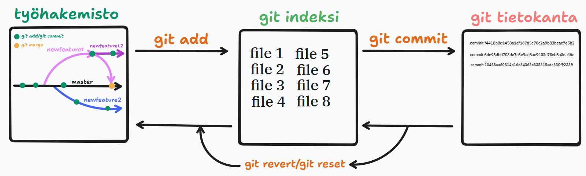

### 1.	Mitä versionhallinnalla tarkoitetaan?
Versionhallinnalla tarkoitetaan tiedon säilöntään ja siihen tehtyjen muutosten historian tallentamista, muokkausta ja hallintaa.

### 2.	Mikä on Git versionhallinta ja mikä on sen historia.
Git on avoimeen lähdekoodiin perustuva hajautetun versiohallinnan työkalu, jonka kehitti Torwalds kritisoidun BitKeeperin tilalle.

### 3.	Selitä Git:n käyttöönotto (git alustaminen) työhakemistossa.
Hommahan aloitetaan sillä, että asennetaan Git (mikäli sitä ei ole vielä tehty). Tämän jälkeen luodaan työhakemisto, joka avataan promptiin tai koodieditoriin. Valitulle alustalle syötetään komento git init, joka asentaa gitin työhakemistoon. Tämän jälkeen Git:lle kerrotaan nimi/nikki ja sähköpostiosoite komennolla git config --global (mikälihalutaan Git:n muistava ne jatkossa) user.email ”user@esim.com” tai user.name ”User Name”. Tuo on oleellista, mikäli samassa työhakemistossa on työskentelemässä useampi henkilö. 

### 4.	Mitkä ovat mielestäsi Git versionhallinnan sen peruskäytössä (eilen opitun pohjalta)? Listaa >5 git komentoa.
git init | Asentaa Git:n työhakemistoon. \
git add | Lisää valitun tiedoston indeksiin.\
git commit | siirtää tiedoston/tiedostot versionhallintaan.\
git status | kertoo tiedostojen tilan.\
git log | näyttää kaikki commitit, niitten tekijän ja päiväyksen. \
git revert | voit palauttaa aijemman commitin. \
git branch | voit vaihtaa muutoshaaraa tai luoda kokonaan uuden. \

### 5.	Mikä on muutoksen (commit) ottamisen prosessi?
Kun halutaan luoda committi eli eräänlainen ”snapshot” pitää ensin olla tiedosto(ja) joita tallettaa. Kun tiedosto(t) on olemassa, ne siirretään ensin indeksiin, eli eräänlaiseen välivarastoon komennolla git add, jonka jälkeen ne voidaan siirtää versiohallinnalle komennolla git commit, jolloin sinulla on olemassa piste, minne palata, jos jokin työnvaihe hajottaa projektin.

### 6.	Millainen on muutoksen perumisen prosessi ja siihen liittyvät komennot?
Kun halutaan perua committi on suositeltavaa käyttää komentoa git revert. Se palauttaa projektia taaksepäin haluttuun pisteeseen, sekä luo tästä palautuksesta uuden commitin siltä varalta, että jokin hajoaa ja voit taas palata taaksepäin. git restore palauttaa edellisen version vain halutusta tiedostosta. Vähemmän suosittu keino on git reset, joka poistaa tehdyn commitin logeista ja koko historiasta.

### 7.	Luo kuva/kaavio gitin käytöstä.
